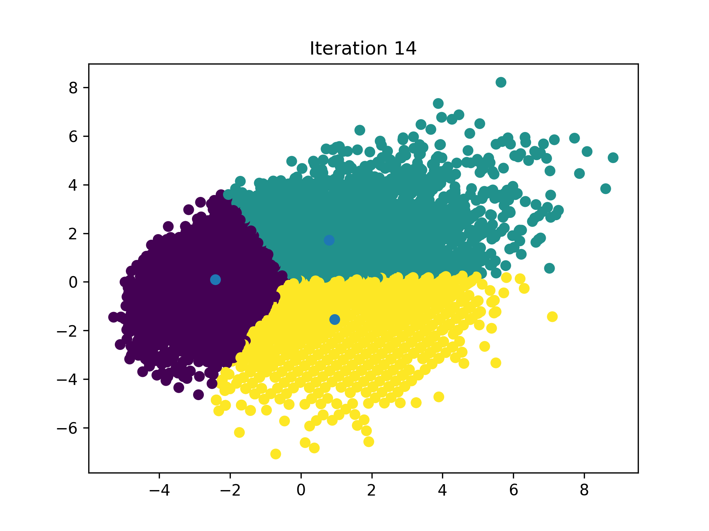

# K-MeansKickoff

Unsupervised player clustering using the K-Means algorithm built **from scratch**, applied to the **FIFA 22 Complete Player Dataset**.

## Overview

**K-MeansKickoff** is a machine learning project where the K-Means clustering algorithm is implemented from the ground up in Python **without using scikit-learn or other ML libraries** to group FIFA 22 players based on their in-game attributes. This project explores unsupervised learning techniques for sports analytics and provides insights into how players can be grouped by playing style, skill levels, and more.

## What the project shows

- How the K-Means clustering algorithm works (initialization, centroid updates, convergence).
- Data preprocessing and feature engineering with real-world sports data.
- Visualizing high-dimensional data and clustering results.
- Player grouping and performance pattern discovery.

## Dataset

- **Source:** [FIFA 22 Complete Player Dataset](https://www.kaggle.com/datasets/stefanoleone992/fifa-22-complete-player-dataset) (Kaggle)
- Includes over 19,200 players with dozens of attributes (overall rating, pace, shooting, passing, etc.)

## Features

- ✅ K-Means algorithm coded entirely from scratch  
- ✅ Custom initialization, distance metric, and convergence criteria  
- ✅ Data normalization and feature selection
- ✅ 2D visualization of clustered players using PCA or t-SNE

## Example Output

  
*Visualization of players clustered into different playstyle groups.*

## 🛠️ Tech Stack

- Python 3.x
- Numpy
- Pandas
- Matplotlib / Seaborn

## Setup & Usage

1. Clone the repository:

   ```bash
   git clone https://github.com/keneandita/K-MeansKickoff.git
   cd K-MeansKickoff
   ```

2. Install dependencies:

   ```bash
   pip install -r requirements.txt
   ```

3. Run the main script:

   ```bash
   python main.py
   ```

## Possible Improvements

* Try different distance metrics (cosine, Manhattan)
* Implement K-Means++ initialization
* Use DBSCAN or hierarchical clustering for comparison
